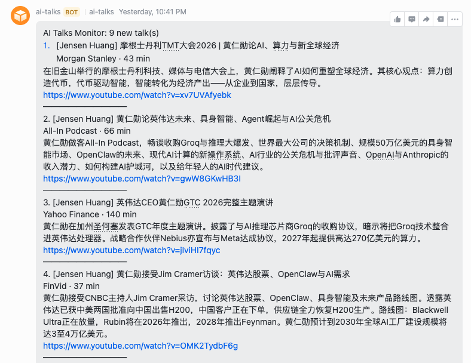
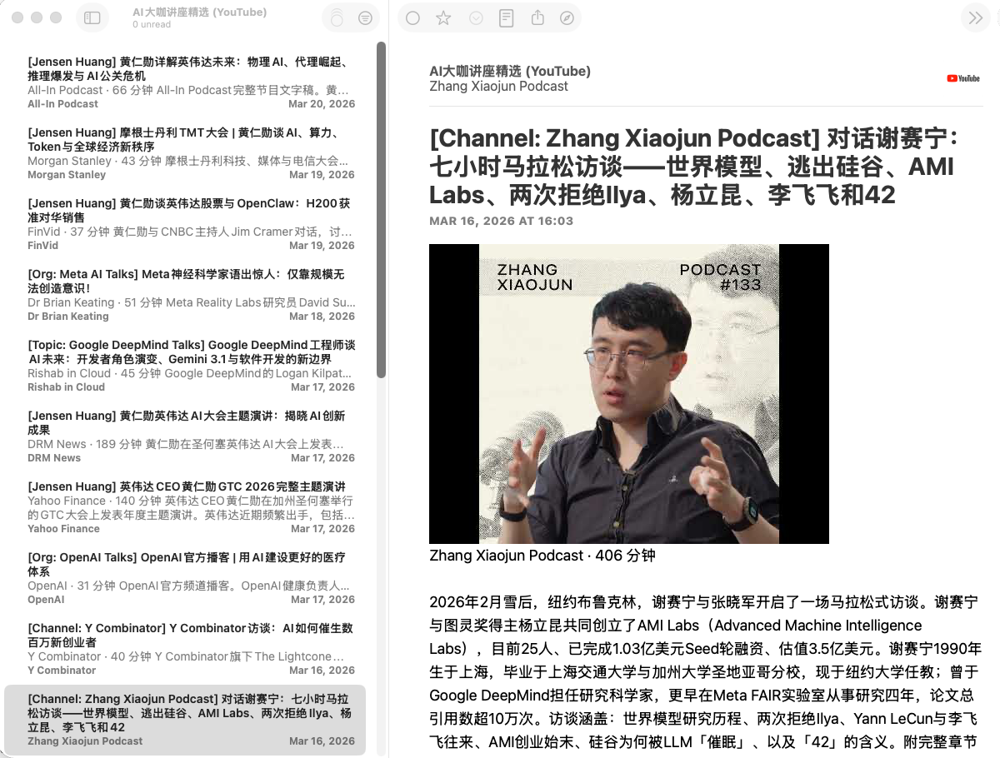

# AI Talks Monitor

[English](README_en.md)

一个 Agent Skill，自动从 YouTube 上追踪顶尖 AI 大咖的一手演讲和访谈，过滤噪音，输出中英双语 RSS 订阅源。

## 为什么做这个

现在 AI 相关的内容太多了，各种反应视频、总结、热评，真正有干货的不多。最有价值但被低估的信息源是什么？直接听当事人怎么说——OpenAI、Anthropic、DeepMind、NVIDIA、Meta AI 这些顶尖 AI 公司核心人物的一手演讲和访谈。

但这些人的内容散落在 YouTube 各个频道，手动追踪几乎不可能。这个 Skill 用 AI Agent 自动搜索、筛选、翻译，帮你省掉这些功夫。

## 适合谁

- 🔥 **AI 狂热者** — 闲暇时间喜欢听大佬访谈播客
- 📝 **内容创作者** — 需要第一时间跟踪最新访谈
- 亦或者想边看访谈边学英语的同学，也可以一试

## 默认覆盖范围

| 类别 | 示例 |
|------|------|
| 🏢 人物 | Sam Altman、Dario Amodei、Jensen Huang、Demis Hassabis、Yann LeCun、李飞飞、吴恩达等 |
| 🎙️ 频道 | 张小珺、Lex Fridman、Dwarkesh Patel、Y Combinator |
| 🔬 机构 | OpenAI、Anthropic、Google DeepMind、NVIDIA AI、Meta AI 团队成员的采访和播客 |

人物、频道、机构均可在 `config.yaml` 中自定义。

<table>
<tr>
<td align="center">
飞书推送效果<br>

</td>
<td align="center">
RSS 阅读效果<br>

</td>
</tr>
</table>

## 直接订阅（无需任何配置）

不想折腾？直接订阅我的 RSS，每天北京时间 10:10 左右更新：

- **英文版：** [ai_talks.xml](https://linzzzzzz.github.io/feeds/ai_talks.xml)
- **中文版：** [ai_talks_zh.xml](https://linzzzzzz.github.io/feeds/ai_talks_zh.xml)

推荐 RSS 阅读器：[NetNewsWire](https://netnewswire.com/)（免费，macOS/iOS）、[Inoreader](https://www.inoreader.com/)（免费，网页版）等。也可以直接加到 [TrendRadar](https://github.com/sansan0/TrendRadar) 的 RSS 订阅源中，和你的每日热点简报一起推送。

## 自己部署

想集成到自己的小龙虾并且自定义追踪谁？用自己的配置跑起来。

### 工作原理

```
YouTube 搜索 → 启发式预过滤 → LLM 分类 → 翻译enrichment → RSS 输出
```

1. **搜索** — 按 watchlist 搜索 YouTube，过滤反应视频、总结、剪辑
2. **分类** — LLM 子代理按类别审核，只保留真正的一手演讲和访谈
3. **翻译** — 为通过的内容生成中文标题和摘要
4. **发布** — 生成 RSS 订阅源，更新状态，推送通知（Telegram/飞书）

每隔几小时自动跑一次。搜索步骤可以安全地无人值守调度。

### 前置条件

- **LLM Agent** — 需要 [OpenClaw](https://openclaw.com)（已在 MiniMax 2.5 和 2.7 下测试通过）或 [Claude Code](https://claude.com/claude-code)。分类步骤（第二步）由 LLM Agent 完成，本 Skill 不能作为独立 CLI 工具使用。
- **YouTube Data API v3 密钥** — [免费获取](https://console.cloud.google.com)。默认配置用 yt-dlp 做搜索（不需要 key），用 YouTube API 做元数据补全。没有 API Key 时元数据回退到 yt-dlp，经常触发机器人检测，导致数据不完整、feed 生成失败。
- **Python 3.9+**

### 安装

**1. 安装为 Skill**

OpenClaw：
```bash
git clone https://github.com/linzzzzzz/ai-talks-monitor-skill ~/.agents/skills/ai-talks-monitor
```

Claude Code：
```bash
git clone https://github.com/linzzzzzz/ai-talks-monitor-skill ~/.claude/skills/ai-talks-monitor
```

**2. 安装依赖**

```bash
pip install requests pyyaml yt-dlp
```

**3. 设置环境变量**

| 变量 | 是否必须 | 用途 |
|------|----------|------|
| `YOUTUBE_API_KEY` | **必须** | YouTube Data API v3 密钥（[免费获取](https://console.cloud.google.com)）。默认配置用 yt-dlp 做搜索（不需要 key），用 YouTube API 做元数据补全——这种混合模式既省 API 配额又能拿到可靠的元数据（发布日期、完整描述）。如果没有 API Key，元数据也会回退到 yt-dlp，而 yt-dlp 经常触发 YouTube 的机器人检测，导致数据不完整、feed 生成失败。 |
| `AI_TALKS_FEEDS_REPO` | 否 | 本地 git 仓库路径，用于自动发布 feed 到 GitHub Pages |
| `TELEGRAM_BOT_TOKEN` | 否 | Telegram 通知 |
| `TELEGRAM_CHAT_ID` | 否 | Telegram 聊天/频道 ID |

**4. 运行**

直接告诉你的 Agent：

> "帮我查一下最新的 AI 演讲"

或手动执行：

```bash
# 第一步：搜索候选
python3 scripts/check_talks.py --fetch-candidates

# 第二步：分类（由 Agent 通过 SKILL.md 完成）

# 第三步：准备已接受内容
python3 scripts/check_talks.py --prepare-accepted output/scratch/review.json

# 第四步：提交到 feed
python3 scripts/check_talks.py --commit-file output/scratch/accepted.json
```

首次运行建议加 `--lookback-days 30` 搜索更长时间范围。

### 自定义配置

编辑 `config.yaml`：

```yaml
thought_leaders:
  - name: "Sam Altman"
    search_query: '"Sam Altman" interview'
  - name: "你想追踪的人"
    search_query: '"你想追踪的人" interview OR talk'

channels:
  - name: "你的频道"
    channel_url: "https://www.youtube.com/@yourchannel"

orgs:
  enabled: true
  searches:
    - name: "你的机构"
      search_query: '"你的机构" researcher talk podcast'
      org: "机构名称"
```

### 通知配置

每次 `--commit-file` 后可自动推送通知。支持三种方式：

| 方式 | 说明 |
|------|------|
| `none` | 不发送通知（默认推荐，先跑通再开） |
| `native` | 内置 Telegram 推送，需设置 `TELEGRAM_BOT_TOKEN` 和 `TELEGRAM_CHAT_ID` |
| `openclaw` | 通过 OpenClaw 推送到 Telegram 或飞书 |

```yaml
notifications:
  backend: "none"          # "none"、"native"（Telegram）、"openclaw"（Telegram/飞书）
  language: "zh"           # "zh"：用中文标题推送；"original"：用原始语言
  include_excerpt: true    # 推送中附带摘要

  # backend: "native" 时的配置
  native:
    channel: "telegram"
    target: ""             # Telegram chat ID 或 channel ID

  # backend: "openclaw" 时的配置
  openclaw:
    channel: "feishu"      # "telegram" 或 "feishu"
    target: ""             # 如 "feishu:group:oc_xxx" 或 Telegram chat ID
```

### TrendRadar 集成

如果你在用 [TrendRadar](https://github.com/sansan0/TrendRadar) 做热点监控，可以把 AI 演讲 feed 加到 TrendRadar 配置中，让 AI 大咖访谈出现在你的每日简报里：

```yaml
# 在 TrendRadar 的 config/config.yaml 中，rss.feeds 下添加：
- id: "ai-talks"
  name: "AI Thought Leader Talks"
  url: "file:///path/to/ai-talks-monitor/output/ai_talks.xml"
  max_age_days: 30
  enabled: true
- id: "ai-talks-zh"
  name: "AI大咖讲座精选"
  url: "file:///path/to/ai-talks-monitor/output/ai_talks_zh.xml"
  max_age_days: 30
  enabled: true
```

## CLI 参考

```
--fetch-candidates           搜索 YouTube，过滤，写入候选文件
--prepare-accepted FILE      合并 review 到 accepted.json
--apply-enrichment FILE      合并 LLM 生成的字段到 accepted.json
--commit-file FILE           生成 RSS feed，更新状态，发送通知
--dry-run                    预览模式，不写入文件
--lookback-days N            覆盖搜索时间窗口
--limit N                    每类只处理前 N 条（测试用）
```

## 文件说明

| 文件 | 用途 |
|------|------|
| `SKILL.md` | Agent 指令 |
| `CLASSIFY.md` | 分类规则参考 |
| `config.yaml` | 追踪列表和配置 |
| `scripts/check_talks.py` | 主脚本 |
| `output/state.json` | 持久状态（已见 ID、RSS 条目） |
| `output/scratch/` | 每次运行的工作文件（候选、审核、翻译） |
| `output/ai_talks.xml` | 英文 RSS feed |
| `output/ai_talks_zh.xml` | 中文 RSS feed |